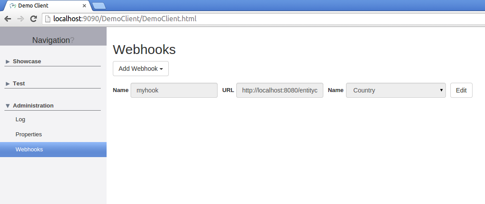

# Webhooks

From [Wikipedia](http://en.wikipedia.org/wiki/Webhook)

<cite>
Webhooks are "user-defined HTTP callbacks". They are usually triggered by some event, such as pushing code to a repository or a comment being posted to a blog. When that event occurs, the source site makes an HTTP request to the URI configured for the webhook. Users can configure them to cause events on one site to invoke behaviour on another.
</cite>

Mango allows the registration of those webhooks for a for a variety of events that occur inside an Mango application.
Webhooks can be either registered using a REST Api or alternatively using a UI that is included in Mango.

## Entity webhook

Webhooks can be registered for the following entity events:

| Event      | Description |
|------------|-------------|
| ON_CREATE  | Called when a new entity is persisted |
| ON_DELETE  | Called on entity removal  |
| ON_SAVE    | Called when an already existing entity is updated  |

when one of these events occur a HTTP POST call is made to the URL given for the webhook containing some meta information  about the event, as well as the entity that triggered the event as payload.

**example request body for an entity ON_CREATE webhook event**

```java
{
    event: "ON_CREATE",
    timestamp: 1424283565853
    payload: {
        id: 234
        countryName: "Germany",
        [...]
    }
}
```

Each request contains the following attributes:

| Attribute      | Description |
|------------|-------------|
| event  | Event type that triggered the webhook call |
| timestamp | Timestamp when the event occurred |
| payload    | The entity that triggered the event |


### REST Api

### Register entity webhook

New entity webhooks can be registered via a HTTP POST to the webhook api, the details of the hook can be defined via attrutes inside the request body.

`POST /api/entity/{entityName}/webhooks`

| Attribute      | Description |
|------------|-------------|
| name  | A unique name for the webhook that can later be used to refer to this hook |
| url | URL that gets called when a webhook events occurs

**example entity webhook registration**
```bash
curl -d'{ "name": "hook4", "url": "http://server/callbck" }' -X POST -H "Content-Type: application/json" http://localhost:9090/remote/api/entity/country/webhooks
{
  "definitionId": "entity",
  "name": "hook4",
  "type": "io.pelle.mango.demo.server.showcase.Country",
  "url": "http://server/callbck",
  "events": [],
}
```

### List registered entity webhooks

A GET request to the entity webhook api show a list of all registered entity webhooks.

`GET /api/entity/{entityName}/webhooks`

**list entity webhooks example**
```bash
curl -X GET -H "Content-Type: application/json" http://localhost:9090/remote/api/entity/country/webhooks
[
    {
      "definitionId": "entity",
      "name": "hook4",
      "type": "io.pelle.mango.demo.server.showcase.Country",
      "url": "http://server1/callbck",
      "events": []
    },
    {
      "definitionId": "entity",
      "name": "hook1",
      "type": "io.pelle.mango.demo.server.showcase.Country",
      "url": "http://server3/callbck",
      "events": [ "ON_DELETE" ]
    }

]
```

### Delete entity webhooks

To delete an entity webhook issue a HTTP DELETE request against the entity webhook api
using the name of the hook to delete as path parameter.

`DELETE /api/entity/{entityName}/webhooks/{hookName}`

**delete entity webhook example**
```bash
curl -X DELETE -H "Content-Type: application/json" http://localhost:9090/remote/api/entity/country/webhooks/hook4
```

### UI

Of course all of the above can also be achieved by using the web ui. To add the webhook  to your application just add the module to your navigation tree.

**entity webhook UI navigation tree example**
```java
navigationnode Administration {
	navigationnode Webhooks {
		moduleDefinition Webhook
	}
}
```

**entity webhook UI example**



