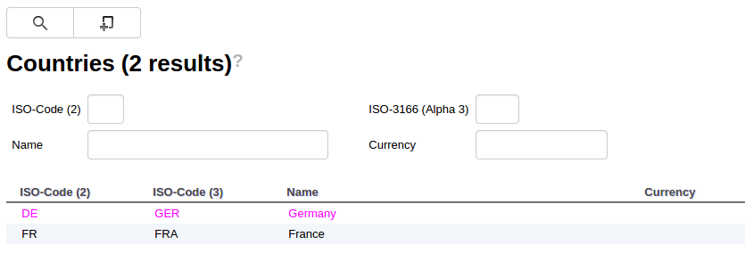

# Hooks
## Overview
The default behavior of the dictionary can be altered via hooks that can be registered in the model. Hooks are typically callbacks that (when registered) are called by the dictionary in various places.
See example below for a hook that gets called when the content of an editor is saved.

Hook can be registered via the generated model class that provides convenient methods for registration where feasible.

**dictionary hook example**
```java
MangoDemoDictionaryModel.COUNTRY.COUNTRY_EDITOR.addEditorHook(new BaseEditorHook<CountryVO>() {

	@Override
	public void onSave(AsyncCallback<Boolean> asyncCallback, CountryVO vo) {
		vo.setCountryExchangeRate(new BigDecimal(1.56));
		asyncCallback.onSuccess(true);
	}
});
```

## Tables

### Row Styles

All table based containers (tables, editable tables, result tables, ...) can be enriched with an `IBaseTableHook` using the generated model.
The CSS styling of table rows can be influenced by overriding `getStyleName` method.

**row style hook example**
```java
MangoDemoDictionaryModel.COUNTRY.COUNTRY_SEARCH.COUNTRY_RESULT.setTableHook(new BaseTableHook<CountryVO>() {
	@Override
	public String getStyleName(CountryVO tableRow) {
		if (tableRow.getCountryIsoCode2().toLowerCase().equals("de")) {
			return "countryResultRow";
		} else {
			return super.getStyleName(tableRow);
		}
	}
});
```

with the corresponding CSS style

**row style hook example (css)**
```java
.countryResultRow {
	color: #ff00ff;
}
```

results in a different color for all rows matching the criteria in the hook

**running row style hook example**


## Search

### Create Button
