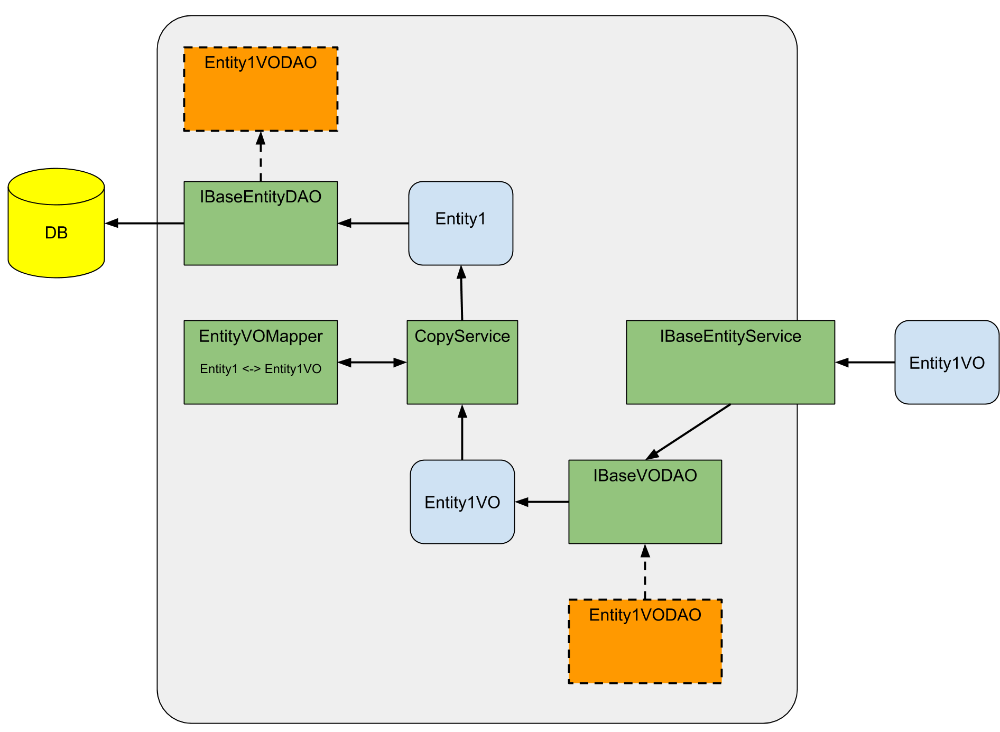

# Entity Model

The basic building block you need before you start working with data when using JPA is to create a entities to work with data from a database (entities as in [entity relationship model](http://en.wikipedia.org/wiki/Entity%E2%80%93relationship_model) just to be clear). This chapter will outline the entity model that can be used to create such entities.

## Entity model basics

Just like in a traditional ER diagram an entity is composed of attributes and references (in ER: relationships) to other entities. The notation is loosely based Java/JavaScript class definitions, so let’s start with a minimalistic example. Entity definitions start with the keyword **entity** followed by the name of that entity.

**basic entity example**
```java
entity Entity1 {
    [...]
}
```
This example is pretty useless because it has no attributes, but lets nevertheless have a look at the generated code.

**generated entity code example**
```java
@Entity
@Table(name = "entity1")
public class Entity1 extends BaseEntity {

		public static final IEntityDescriptor<Entity1> ENTITY1 = new EntityDescriptor<Entity1>(Entity1.class);

    public static LongAttributeDescriptor ID = new LongAttributeDescriptor(ENTITY1, "id");

	@Id
	@Column(name = "currency_id")
	@GeneratedValue(strategy = GenerationType.TABLE, generator = "currency_id_seq")
	@SequenceGenerator(name = "currency_id_seq", sequenceName = "currency_id_seq", allocationSize = 1)
	private long id;

	public long getId() {
		return this.id;
	}

	public void setId(long id) {
		this.id = id;
	}

}
```

From the above entity definition a plain JPA entity is generated. The name of the class and the underlying DB table (given by JPAs *@Table* annotation) is (as one would suspect) derived from the name of the entity. For each entity a *id* attribute is automatically generated to identify each entity instance, using a JPA table sequence generator. This may not always be the best option for every usecase, so this behavior can be tuned by the generator configuration.
The interesting part are the two static fields that are also generated. these two fields provide meta information for the entity respectively the id field. These meta information is needed because the model may contain more information about an specific datatype than can not be expressed using simple Java types (for example the maximum or minimum size for an integer). Also the meta information provides type information for generic collections that would normally not be available due to Java [type erasure](https://docs.oracle.com/javase/tutorial/java/generics/erasure.html).

Now lets add an attribute to the entity to make it finally useful:

**entity attribute example**
```java
entity Entity1 {
    string stringAttribute1
}
```
Like in Java field definitions each attribute has a type and an attribute name. Lets again look at the generated source code.

**generated attribute code example**
```java
@Entity
@Table(name = "entity1")
public class Entity1 extends BaseEntity {

    //[...]

    public static IAttributeDescriptor<?>[] getAttributeDescriptors() {
		return new IAttributeDescriptor[]{
			STRINGATTRIBUTE1
		};
	}

	@Column(name = "entity1_stringattribute1")
	private String stringAttribute1;

	public static StringAttributeDescriptor STRINGATTRIBUTE1 = new StringAttributeDescriptor(ENTITY1, "stringAttribute1", String.class, -1, -1, 0);

	public String getStringAttribute1() {
        return this.stringAttribute1;
    }

    public void setStringAttribute1(String stringAttribute1) {
        getChangeTracker().addChange("stringAttribute1", stringAttribute1);
        this.stringAttribute1 = stringAttribute1;
    }
}
```
To avoid collisions and from foreign keys the column names for the generated attributes are prefixed with the table name. Again an attribute descriptor providing meta information for the field is generated that can (alongside with all other generated attribute descriptors) be retrieved using the *getAttributeDescriptors* method.

The benefit of these meta information fields is that they enable the DSL-like creation of JPA queries.

**entity query example**
```java
SelectQuery<Entity1> query = SelectQuery.selectFrom(Entity1.class).where(Entity1.STRINGDATATYPE1.eq("abc"));

for (Entity1 entity1 : dao.filter(query)) {
	// do something
}

```
Each attribute descriptor provides based on its type a variety of methods to create JPA expressions (equals/not equals/less than/....).

### Datatypes

The types used for entity attributes are derived from Javas simple types and therefore lack the possibility to express more informations about the datatype (maximum length for strings for example) Mango has a concept of datatypes that provides this facilities.

> The functionality has basically the same function that is described in the JSR 303 Bean Validaton API and may one day be merged with this.

**entity datatype example**
```
stringdatatype StringDatatype1 {
}

entity Entity1 {
    string StringDatatype1 stringAttribute1
}
```

The above example defines an string datatype that is used in the entity attribute *stringAttribute1* the generator output is exactly the same as in the above datatype less example. The fun parts begins when the extra datatype information is used.

**entity datatype restrictions example**
```java
stringdatatype StringDatatype1 {
    maxLength 42
    minLength 2
}

entity Entity1 {
    string StringDatatype1 stringAttribute1
}
```
The above example restricts the dimensions of the string that may be stored in *stringAttribute1*.

**generated datatype attribute code example**
```java
@Entity
@Table(name = "entity1")
public class Entity1 extends BaseEntity {

    //[...]

	public static StringAttributeDescriptor STRINGATTRIBUTE1 = new StringAttributeDescriptor(ENTITY1, "stringAttribute1", String.class, 2, 42, 0);

    //[...]

}
```
The **maxLength**/**minLength** values are feed into the attribute descriptor via its constructor and checked before an entity is persisted. Therefore it is now impossible to persist entities with a *stringAttribute1* that shorter than 2 an longer that 42 characters.

### Value Objects

What may be confusing at first is the fact that for each entity an value object is generated that has basically the same attributes/attributes descriptors as the entity. Entities will never leave the server. All client facing interfaces work on base of value objects and not with entities.
Mango internally copies the data back and forth between these two types. The value objects that are generated for each entity have additional facilities that circumvent the lack of reflection inside the GWT runtime inside the browser.

**generated value object**
```java
public class Entity1VO extends BaseVO implements IInfoVOEntity {

    // [...]

	public Object get(String name) {

		if ("stringAttribute1".equals(name))
		{
			return this.stringAttribute1;
		}

		return super.get(name);
	}

	public void set(String name, Object value) {

		getChangeTracker().addChange(name, value);

		if ("stringAttribute1".equals(name))
		{
			setStringDatatype1((String) value);
			return;
		}

		super.set(name, value);
	}
}
```
The above code example shows the generated generic getters/setter for the entity attributes. The dictionary interpreter use these getters/setters instead of (the missing) reflection.

### Entity DAO Services

Two low level services provide basic persistence functions for entities/value objects, the *IBaseEntityDAO* for entities and the *IBaseVODDAO* for value objects (these two are nearly identical, in fact they are derived from the same basic service interface just with different generic types for entities/value objects).

The *IBaseVODAO* internally copies the data from/to the entity/value object using the copy service. Despite the fact that one the server you are free to use entities/value objects or both, it is advisable to always use the value object based *IBaseEntityService* as you would from any client side code.
The *IBaseEntityService* provides some higher level persistence functions as well as validation based on the datatype metadata.



As *IBaseEntityDAO* and *IBaseVODDAO* provide generic persistence functionality for all entities or value objects you may want to add specialized persistence behavior for your own entities or value objects. This can be achieved be registering an entity/value object specific *EntityDAO*/*VODAO*.

For each entity an basic *Base{entity name}EntityDAO*/*Base{entity name}VODAO* is generated. This default implementation defaults to the normal entity/value object DAO behavior. You can override this default implementation to add your own business logic.

**entity DAO example**

To create a new entity specific DAO extend the generated *BaseDAO* for the entity:
```java
public class CountryEntityDAO extends BaseCountryEntityDAO {

	@Override
	public Country create(Country entity) {
		if (entity.getCountryIsoCode2() != null) {
			entity.setCountryIsoCode2(entity.getCountryIsoCode2().toUpperCase());
		}
		return super.create(entity);
	}
}
```

and register the DAO in your Spring application context:

```xml
<bean class="io.pelle.mango.demo.server.test.CountryEntityDAO" />
```

### Entity Options
The entity model provides several options that control the general behavior of the generated entities.
The options are defined in a entity options block inside the entity definition:

**entity options example**
```java
entity Entity1 {

    entityoptions {
        [...]
    }

    [...]
}
```
#### Natural Key


#### Entity Label

When an human readable representation of an entity instance is needed (the entity name itself tends to be very technical) you can model the text used for this purpose with the following options:

**entity label example**
```java
entity Entity1 {
    entityoptions {
        label "Country"
        pluralLabel "Countries"
    }
    naturalkey {
        name
    }

    string name

}
```
The *label* is used when a descriptive text is needed for the entity, for example the above entity would be displayed as *"...added **Country** Germany..." to the list...* or if the entity is used in a context where more than one entity has to be described *"... 5 **Countries** found"*.

## Datatypes

### Common properties

All datatypes share a common set of properties that are used by all datatypes. These are described in this chapter.

#### Width

Sooner or later the data described by the datatype has to be displayed somehow to the user, or the user has the ability (e.g. an input field in a web form) to enter some data. To give the actual UI layer implementation a hint how big the input field has to be, the width property can be used.
The most common use case for defining the width in the datatype is when the datatype is used among many different dictionaries (UI models) to avoid spreading the width definition over different places in the model and it may be overwritten later in the UI model.

**datatype width example**
```java
stringdatatype StringDatatype1 {
    width 32
}

entity Entity1 {
    string StringDatatype1 stringAttribute1
}

dictionary Dictionary1 {
    entity Entity1

	dictionarycontrols {
		textcontrol TextControl1 {
			entityattribute Entity1.stringAttribute1
		}
		textcontrol TextControl2 {
			entityattribute Entity1.stringAttribute1
			width 64
		}
	}
}
```

In the above example the control *TextControl1* will have the size to display 32 character, whereas the *TextControl2* will be twice the size (because the size is overridden).

#### Label

The label property has nearly the same semantic as the previously mentioned width property. Here a label text that is used when the value described by a datatype needs to be labeled on the UI can be modeled. Controls using this datatype inherit this label and it can again be overridden in the control definition if needed.

**datatype label example**
```java
stringdatatype StringDatatype1 {
    label "Abc"
}

entity Entity1 {
    string StringDatatype1 stringAttribute1
}

dictionary Dictionary1 {
    entity Entity1

	dictionarycontrols {
		textcontrol TextControl1 {
			entityattribute Entity1.stringAttribute1
		}
		textcontrol TextControl2 {
			entityattribute Entity1.stringAttribute1
			label "Xyz"
		}
	}
}
```

The textcontrol *TextControl1* from the above example inherits it's label from the datatype (Abc: [input field]) and the *TextControl2* uses its own label (Xyz: [input field])
