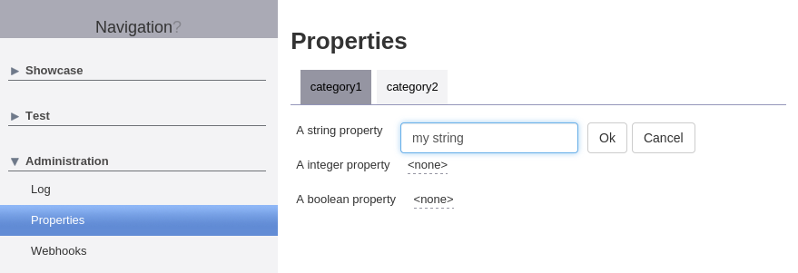

# Properties

Mango includes everything needed to equip your application with configuration options. Parameterization is supported from the command line using Java system properties, using Spring properties from the application context and of course from the database.
The properties are defined using a Java based DSL and support features like fallback to other properties if undefined, default vales and a web interface to change properties live in the frontend.

## Defining properties

Each property is identified by an unique key that is used on the command line/application content/database. 
Furthermore an extra name may be defined that is used as a human readable description for the (in most cases) more technical key. 
Starting point to create a new property is the `PropertyBuilder`, see below for a simple example.

** simple string database property **
```
IProperty<String> DB_PROPERTY = PropertyBuilder.createStringProperty("dbproperty").name("our first database property").database();

IPropertyService propertyService = [...];

// set the value
propertyService.setProperty(DB_PROPERTY, "my property");

// retrieve the previously set value
String dbproperty = propertyService.getProperty(DB_PROPERTY);
```

## Setting default values

Useful defaults for your properties can be defined using the `default(...)` method.

** string property with a default **
```
IProperty<String> DB_PROPERTY = PropertyBuilder.createStringProperty("dbproperty").default("abcdef").database();

// property is not set and returns the default 'abcdef'
String dbproperty = propertyService.getProperty(DB_PROPERTY);

assertEquals("abcdef", dbproperty);
```

## Setting fallback values

Another option to deal wit unset properties is to define a fallback that is used if the property is not set.

### Fallback to another backend.

Fallback to another backend using the same property key is configured using the `database()`, `system()` or `spring()` methods. 

** string database property with a system property fallback **
```
IProperty<String> DB_PROPERTY = PropertyBuilder.createStringProperty("dbproperty").database().fallbackToSystem();

// assuming the web container was started with '-Ddbproperty=ghijkl' the value will be taken from the system property because the database property is not defined
String dbproperty = propertyService.getProperty(DB_PROPERTY);

assertEquals("ghijkl", dbproperty);
```

## Fallback to another property

It is also possible to fallback to another property (of the same type) using the `fallback(...)` method. 

** string database property with fallback to another property **
```
IProperty<String> DB_PROPERTY_DEFAULT = PropertyBuilder.createStringProperty("dbproperty.default").database(;

IProperty<String> DB_PROPERTY = PropertyBuilder.createStringProperty("dbproperty").database().fallback(DB_PROPERTY_DEFAULT);

// set the fallback value
propertyService.setProperty(DB_PROPERTY_DEFAULT, "mnopqrs");

// retrieve the value
String dbproperty = propertyService.getProperty(DB_PROPERTY);

assertEquals("mnopqrs", dbproperty);
```

## Adding properties to the web UI

To activate the web UI add the module to your navigation tree. 

** navigation node for the property module **
```
navigationnode Properties {
	moduleDefinition Property
}
```

Then in your client code add your properties to the `PropertyProvider`. Properties can be grouped logically into categories which will display them in separate tabs in a tabfolder.  

** example for property web UI configuration **
```
IProperty<String> STRING_PROPERTY1 = ...
IProperty<String> INTEGER_PROPERTY2 = ...
IProperty<String> BOOLEAN_PROPERTY3 = ...
IProperty<String> STRING_PROPERTY4 = ...
IProperty<String> STRING_PROPERTY5 = ...
IProperty<String> STRING_PROPERTY6 = ...

IPropertyCategory category1 = PropertyProvider.getInstance().createCategory("category1");

category1.addProperty(STRING_PROPERTY1);
category1.addProperty(INTEGER_PROPERTY2);
category1.addProperty(BOOLEAN_PROPERTY3);

IPropertyCategory category2 = PropertyProvider.getInstance().createCategory("category2");
category2.addProperty(STRING_PROPERTY4);
category2.addProperty(STRING_PROPERTY5);
category2.addProperty(STRING_PROPERTY6);
```
** example of the property web ui **

		