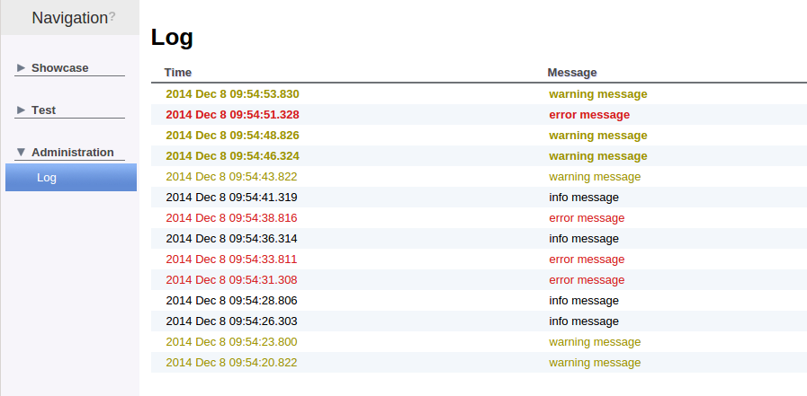
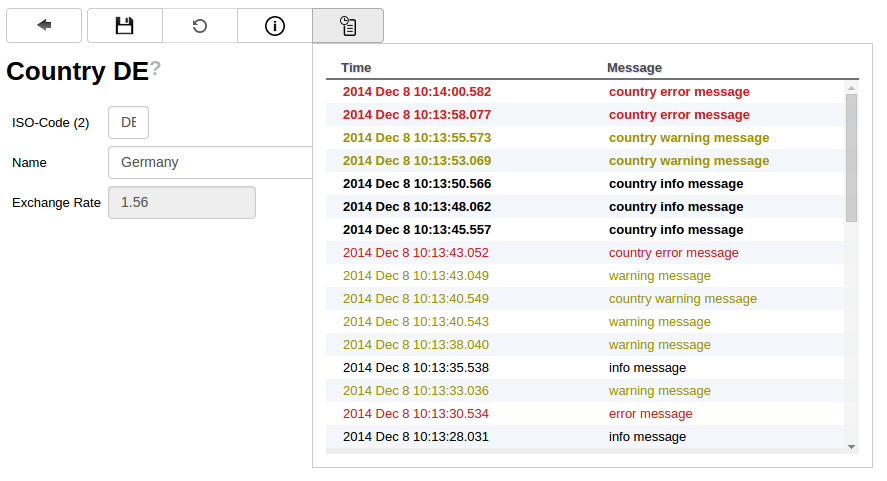

# Logging

Mango also provides a small logging abstraction that is intended for functional logging of application events. To minimize the performance impact the logging is asynchronous and takes places in a different transaction to minimize the impact on our business code.


## Using the logger

The logger can be injected like any other Spring bean and provides three well known log levels that can be used to mark the severity of the log entry

**Example usage**
```java
@Autowired
private IMangoLogger logger;

logger.info("info message");
logger.warn("warning message");
logger.error("error message");
```

## Logging Viewer

A log viewer to view these log entries is also provided, just add the provided log module to the applications navigation tree

**Log Module**
```java
navigationnode Administration {
	navigationnode Log {
		moduleDefinition Log
	}
}
```

The log viewer provides a simple list that can endlessly be scrolled in each direction. Scrolling down goes backwards through the log history, scrolling up requests new log entries from the log if the first entry is reached. New fetched entries are displayed in bold to distinguish them from the old entries.

**Log Viewer**


# Logging with references

If you want to log information that belongs to a certain entity the logger provides a special `reference` field that can be used to attach log entries to arbitrary objects.
The object that the log entry will be attached to is converted into a `String` by an `ILogReferenceKeyMapper` instance that should be registered for the object type that is given to the logger.


```java
public interface ILogReferenceKeyMapper {

	String getReferenceKey(Object object);

	boolean supports(Class<?> referenceClass);

}
```

A `ILogReferenceKeyMapper` for entities is already provided so to log messages for an entities just feed the entity as reference into the logger

**Logging with references**

```java
@Autowired
private IMangoLogger logger;

CountryVO countryVO = [...]

logger.info("country info message", countryVO);
logger.warn("country warning message", countryVO);
logger.error("country error message", countryVO);
```

The default editor dictionary also provides a log viewer that show the log entries specific for each entity.

**Editor Log Viewer**


