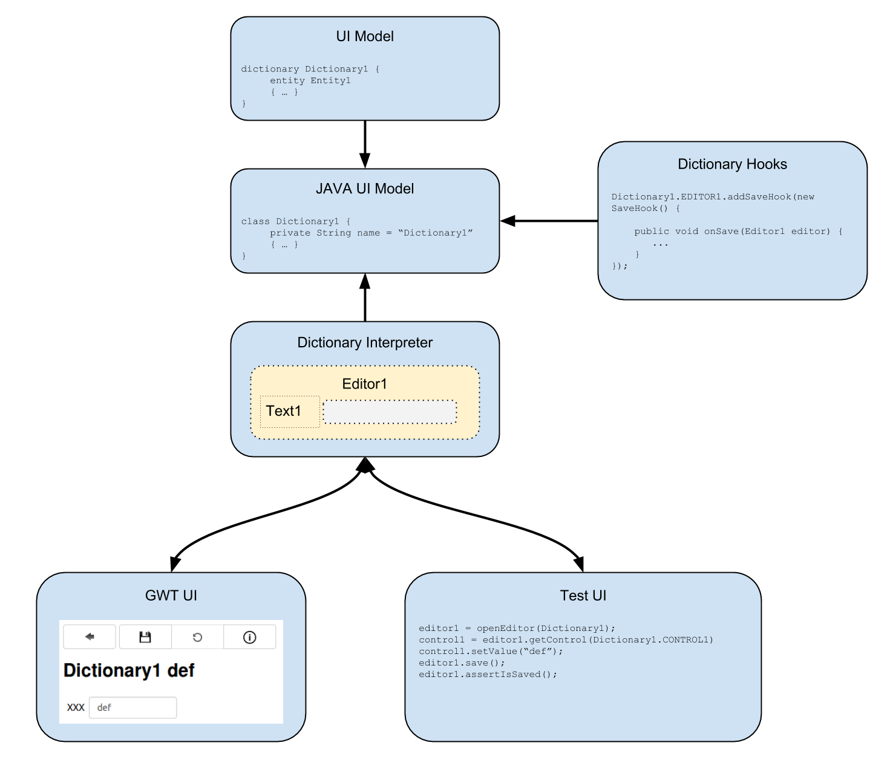

# UI

The overall goal for the UI DSL is to provide a simple generic way to **C**reate **R**ead **U**pdate and **D**elete data entities (which also are modelled in the same DSL, see [The Entity Model]).
The UI is roughly divided in two parts, first the search consisting of a filter where filter criterias can be entered and the result table listing the actual search results for all entities matching the filter criterias. The entity then can be opened in an editor which provides facilities to edit and save the data, as well creation of new entities.
From the UI model DSL a set of classes is generated for each dictionary containing the model informations in a in a way the dictionary interpreter can work with it. The interpreter then builds an abstract runtime model for all dictionary elements (searches, filters, editors, controls, tables, composites, …). The actual GWT based UI implementation then connects to this abstract model using a callback mechanisms.
The abstraction of the dictionary runtime comes with the benefit of the capability to add another UI implementation, in this case a simple Junit layer that can be used to test the dictionary.
The generated Java model classed also provide extensions points where you can hook in you own code, to alter the default behaviour of the dictionary interpreter where needed.



## Dictionary

Each UI model (from now on called dictionary) starts with the **dictionary** keyword followed by a name for the dictionary. The dictionary forms the Klammer holding the search and editor for an specific **entity** that is given by the **entity** keyword in the dictionary definition. 

**basic dictionary definition**
```
entity Entity1 { 
    [...]
}

dictionary Dictionary1 {

    entity Entity1
    
    [...]
}
```

There are (as in nearly every UI framework) two types of UI elements, container and controls. Controls like for example textcontrols or datecontrols are directly mapped to entity attributes with the matching type using the keyword **entityattribute**. Because a control for a single entity attribute is likely to be used in multiple places, the dictionary provides the possibility to define a common set of controls that may be reused in other parts of the model. The *stringAttribute1* for example may be used as a text control in a filter so search for entities with this attribute, in the search result to display the content for this attribute and finally in the editor to edit data for this attribute.

**dictionary definition containing a text control**
```
entity Entity1 { 
    string stringAttribute1
}

dictionary Dictionary1 {

    entity Entity1
    
    dictionarycontrols {
        TextControl1 {
            entityattribute stringAttribute1
        }
    }
}
```

